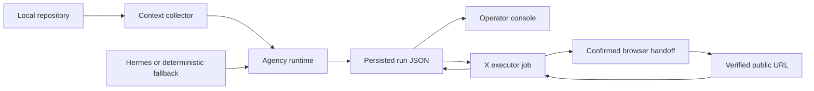

# Architecture

This document describes the current Wingbeat prototype. The [product concept](./product-concept.md) describes the larger direction; it should not be read as a list of shipped features.

## System boundaries



### Context collection

`src/agency/context.mjs` reads selected product docs, recent git history and status, and the workspace shape. It builds a context envelope with the current objective, project history, and publishing guardrails.

Repository content is untrusted data. Context collection must not evaluate code or treat text found in a repository as an instruction to bypass policy. The current scanner is local and deliberately ignores generated or high-volume directories.

### Generation and agency runtime

`src/agency/hermes.mjs` is the model boundary. A run may use a configured Hermes CLI or a deterministic local fallback. Those providers must remain distinguishable in persisted data and in the UI.

`src/agency/runtime.mjs` coordinates the selected roles, content package, evaluations, trace events, and execution intent. The target revision contract is:

```text
first draft
→ critic evaluation with named findings
→ revised draft when needed
→ final evaluation
→ channel adaptation
```

A deterministic fallback is useful for development, but it is not evidence of project-specific model quality.

### Persistence contract

`src/agency/persistence.mjs` writes run artifacts under `src/agency/runs/` and refreshes the UI-consumable `public/data/latest-run.json`.

The run JSON is the integration contract between the agency, executor, and operator console. It should carry provenance for generated values and distinguish measured, estimated, fixture, fallback, and verified data. Hand-copied UI state is not a second source of truth.

### Operator console

The React application reads `public/data/latest-run.json`. Its job is to explain what actually happened: source evidence, selected agents, draft and evaluation history, execution state, and any verified receipt.

The console must prefer an honest empty or unavailable state over fabricated queues, costs, capabilities, countdowns, or receipts.

### X execution boundary

`scripts/x-execution/x-executor.mjs` owns the execution state machine:

```text
queue → veto → ready → published
                 ↘ blocked
```

The executor prepares a job and mirrors state back into the matching run. Exporting a browser task requires the job to be ready and the operator to provide the exact action-time confirmation string. Publication is complete only after the public post URL is verified and stored as a receipt.

The browser boundary uses an existing signed-in session. It must not inspect cookies, browser storage, auth headers, password-manager data, or browser profile files. The full contract is documented in [browser-x-executor.md](./browser-x-executor.md).

## Data flow and sources of truth

| Concern | Current source of truth | Consumer |
|---|---|---|
| Project context | Context envelope created for a run | Agency runtime |
| Generation provenance | Run generation metadata | Console and evaluation |
| Content and trace | Persisted run JSON | Console and executor |
| Execution status | Executor job, mirrored into its matching run | Console |
| Publication proof | Verified receipt in executor job and matching run | Console |

The executor job owns state transitions after a content package enters execution. The persisted run is the read model exposed to the UI.

## Trust model

Wingbeat crosses three sensitive boundaries:

1. **Repository to model:** a Hermes-backed run may send repository-derived context to its configured provider. Operators must review privacy requirements first.
2. **Generated content to execution:** generated copy is not permission to publish. It must pass policy checks and enter the executor state machine.
3. **Executor to browser:** a ready job still requires fresh, exact action-time confirmation in the current prototype.

Secrets do not belong in run JSON, fixtures, logs, browser tasks, or issue reports.

## Failure behavior

- If Hermes is unavailable, the run should identify the deterministic fallback rather than present it as a model result.
- If evaluation fails, the run should preserve the findings and request a revision rather than silently overwrite the draft.
- If the veto window is active, publishing remains unavailable.
- If browser execution cannot proceed, the job remains ready or becomes explicitly blocked; it is not marked published.
- If receipt recording fails after a post is live, retry receipt recording with the same verified public URL.
- If persisted run and executor identifiers do not match, mirroring should fail or skip according to whether the target path was explicit.

## Near-term architecture work

- Make first-draft evaluation and revision fully model-driven and observable.
- Add schema validation at persistence and execution boundaries.
- Add repository allowlists and redaction for model-bound context.
- Add notification and restart-safe scheduling without weakening confirmation controls.
- Replace manual integration assumptions with end-to-end tests using synthetic accounts and fixtures.
