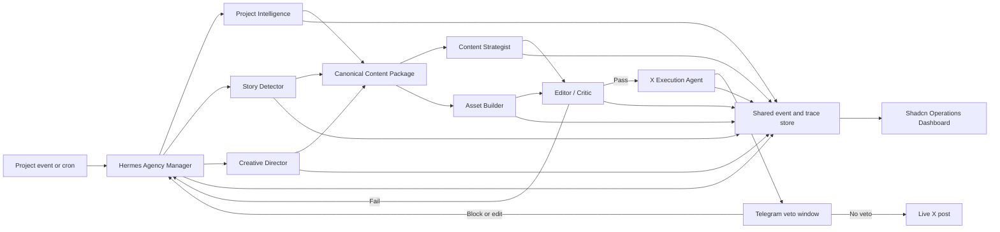

# Wingbeat: Two-Hour AI Agency MVP Roadmap

Status: Working execution roadmap.

## Recommended approach

For a two-hour MVP, build the whole agency spine but only one real job: detecting, creating, evaluating, notifying, and publishing an X build-in-public post.

Three possible architectures:

- **Monolithic agent:** fastest, but scores poorly.
- **Fixed multi-agent pipeline:** reliable, but likely caps agent-organization scoring around L3.
- **Dynamic manager, specialist registry, and shared event log:** slightly more work, but makes L4/L5 organization, observability, memory, and evaluation demonstrable. This is the recommended architecture.

## Two-hour target

At minute 120, a judge can:

1. Point Wingbeat at a real project.
2. Watch the manager inspect the job and assemble a specialist team.
3. See agents work in parallel.
4. See a weak draft rejected and revised.
5. Receive a Telegram veto notification.
6. Allow the countdown to expire.
7. Open the real published X post.
8. Inspect the complete trace, costs, evaluation, memory, and receipt.
9. Compare the successful run with an earlier failed run.
10. Create a new specialist role from the UI.

## Architecture



The manager should dynamically select roles. For a text-only post, it skips Asset Builder. If a story needs a product mockup, it creates a temporary Product Mockup Specialist. This visible decision is the strongest L5 agent-organization demonstration.

## Parallel workstreams

Four agents or builders can work independently after agreeing on shared schemas.

### Lane A: Agency runtime

Build:

- Hermes manager skill.
- Specialist registry.
- Dynamic plan generation.
- Parallel delegation.
- Revision and escalation loop.
- Three-layer context envelope:
  - Current job.
  - Project history.
  - Brand and publishing policy.

Contract:

```ts
delegate({
  runId,
  role,
  objective,
  contentPackageId,
  contextEnvelope,
  tools,
  guardrails
})
```

### Lane B: Data, evaluation, and observability

Build the shared state model:

- `Run`
- `AgentNode`
- `TraceEvent`
- `ContentPackage`
- `EvalResult`
- `ExecutionJob`
- `PublishReceipt`
- `Policy`
- `AgentRole`

Required observability:

- Parent-child trace tree.
- Inputs and outputs per step.
- Tokens, estimated cost, and latency.
- Agent/task filters.
- Passing-versus-failing run comparison.
- One real failure alert.
- Search across runs.
- Live X receipt.

Use Convex as the state and event backend if available. This creates a genuine +25 partner power-up.

### Lane C: Shadcn dashboard

Build only four screens.

#### 1. Operations

- Today/Week queue inspired by the shared ContentWriter screenshot.
- Running, ready, veto countdown, overdue, published, blocked, and failed states.

#### 2. Run detail

- Agent trace tree.
- Current agent organization.
- Step drawer containing evidence, output, evaluation, latency, and cost.
- Compare-run action.

#### 3. Catalog

- Canonical content package.
- Source evidence.
- Channel-neutral story.
- X adaptation and asset.
- Reuse status.

#### 4. Agency

- Role registry.
- Simple Create Role form:
  - Name.
  - Job.
  - Tools.
  - Guardrails.
- Ability to start one job with the newly created role.

CRM becomes one compact audience panel inside Catalog for this MVP, not a separate CRM product.

### Lane D: Real execution

Build:

- X posting adapter.
- Telegram notification.
- Countdown state.
- Edit, delay, and block controls.
- Default publish on silence.
- Live-post verification.
- Publish receipt.
- Offline recovery represented by an overdue job replayed on startup.

This is the highest-risk lane and must start immediately.

## Shared content contract

All agents read or enrich the same object:

```ts
interface ContentPackage {
  id: string
  projectContext: ProjectContext
  sourceEvents: SourceEvent[]
  evidence: Evidence[]
  whatChanged: string
  whyItMatters: string
  audience: Audience
  category: ContentCategory
  narrative: string
  supportedClaims: Claim[]
  prohibitedClaims: Claim[]
  hooks: string[]
  channelNeutralBody: string
  assetBrief?: AssetBrief
  assets: Asset[]
  confidence: number
  evaluations: EvalResult[]
  adaptations: ChannelAdaptation[]
  executionHistory: ExecutionRecord[]
}
```

The X agent may add an adaptation but cannot mutate the underlying evidence or supported claims. This preserves future Reddit reuse.

## 120-minute schedule

### Minutes 0–10: Contracts and skeleton

All lanes agree on:

- Entities and status enums.
- Event schema.
- Content-package schema.
- Three test project events.
- One X account and Telegram recipient.
- Exact demo happy path.

Create the Vite/React/shadcn dashboard, Convex project, and Hermes skill skeleton.

### Minutes 10–45: Parallel construction

- Lane A builds the manager, role selection, and parallel delegation.
- Lane B builds persistence, tracing, evaluations, and seed runs.
- Lane C builds Operations and Run Detail using seeded data.
- Lane D gets one hard-coded Telegram-to-X execution working.

Do not wait for polished content generation before proving real posting.

### Minutes 45–70: Connect the spine

Connect:

```text
Project event
→ Manager plan
→ Parallel specialists
→ ContentPackage
→ Critic gate
→ ExecutionJob
→ Telegram
→ X
→ PublishReceipt
```

By minute 70, one ugly but real post must complete end to end.

### Minutes 70–90: Scoring features

Add:

- A draft that deliberately fails evaluation.
- Manager revision request.
- Passing second version.
- Dynamic Product Mockup Specialist spawned only for a visual story.
- Per-step cost and latency.
- Failed-run alert.
- Passing-versus-failing run comparison.
- Role-creation form.

These features directly raise organization, observability, evaluation, memory, and management scores.

### Minutes 90–105: Three repeated runs

Execute three different real project events:

1. A technical decision story.
2. A bug/failure-and-lesson story.
3. A visual product-progress story requiring the dynamically spawned Product Mockup Specialist.

Publish all three to the real X account. If posting volume is inappropriate, use one main post plus two real replies or thread posts. Each execution must have an independent trace and receipt.

### Minutes 105–120: Polish and rehearse

Apply the shadcn look:

- Neutral dark surfaces.
- Compact cards.
- Blue for proposed.
- Green for published or passed.
- Orange for veto countdown or overdue.
- Red for blocked or failed.
- Monospace metadata.
- Agent trace tree as the visual centerpiece.

Then rehearse the exact three-minute proof.

## Score target

| Criterion | Target | Proof |
|---|---:|---|
| Real output | L5 | Three autonomous live X executions |
| Agent organization | L5 attempt | Runtime-spawned Product Mockup Specialist and precise escalation |
| Observability | L5 attempt | Trace tree, costs, search, alert, and run diff |
| Evaluation | L4, stretch L5 | Automated publish gate; failure becomes a new evaluation case |
| Memory | L5 | Three-layer context passed through every handoff |
| Cost and latency | L3–L4 | Measured live; do not fake sub-minute performance |
| Management UI | L4, stretch L5 | Non-engineer creates and runs a specialist role |

## Ruthless scope cuts

Do not build during these two hours:

- Reddit execution.
- A full CRM.
- Analytics-driven learning from X performance.
- WhatsApp in addition to Telegram.
- Multiple asset-generation systems.
- Complex authentication or organizations.
- A general workflow builder.
- Full offline scheduling infrastructure.
- Dodo or ElevenLabs integrations.
- Pixel-perfect secondary pages.

Prioritize genuine Convex and Cloudflare integrations for +50 points. Add Linkup only if live search materially helps project or audience research.

## Defining MVP moment

> The manager discovers that the visual story requires a capability it does not currently have, spawns a new specialist, produces the asset, rejects weak copy, publishes after the veto window, and shows the entire process in the trace.
