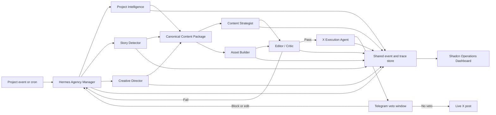

# Wingbeat: Two-Hour AI Agency MVP Roadmap

Status: Working execution roadmap.

Revision note: tightened after external feasibility review to protect the minute-45 real-post milestone and remove unsupported score claims.

## Recommended approach

For a two-hour MVP, build the whole agency spine but only one real job: detecting, creating, evaluating, notifying, and publishing an X build-in-public post.

Three possible architectures:

- **Monolithic agent:** fastest, but scores poorly.
- **Fixed multi-agent pipeline:** reliable, but likely caps agent-organization scoring around L3.
- **Dynamic manager, specialist registry, and shared event log:** slightly more work, but makes L4/L5 organization, observability, memory, and evaluation demonstrable. This is the recommended architecture.

## Two-hour target

At minute 120, a judge can:

1. Point Wingbeat at a real project.
2. Watch the manager inspect the job and assemble a specialist team.
3. See agents work in parallel.
4. See a weak draft rejected and revised.
5. Receive a Telegram veto notification.
6. Allow the countdown to expire.
7. Open the real published X post.
8. Inspect the complete trace, costs, evaluation, memory, and receipt.
9. Inspect at least three independently verified real executions.

Passing-versus-failing run comparison and role creation are stretch proof, not requirements for the core live path.

## Architecture



The manager should dynamically select roles. For a text-only post, it skips Asset Builder. For a bug-postmortem story, it may create a Technical Fact-Checker. If a story needs a product mockup, it creates a temporary Product Mockup Specialist that uses a deterministic branded-card renderer owned by Lane C. Dynamic spawning is the scoring feature; live generative-image or tool-building work is not required.

## Parallel workstreams

Four agents or builders can work independently after agreeing on shared schemas.

### Lane A: Agency runtime

Build:

- Hermes manager skill.
- Specialist registry.
- Dynamic plan generation.
- Parallel delegation.
- Revision and escalation loop.
- Three-layer context envelope:
  - Current job.
  - Project history.
  - Brand and publishing policy.

Contract:

```ts
delegate({
  runId,
  role,
  objective,
  contentPackageId,
  contextEnvelope,
  tools,
  guardrails
})
```

### Lane B: Data, evaluation, and observability

Build the shared state model:

- `Run`
- `AgentNode`
- `TraceEvent`
- `ContentPackage`
- `EvalResult`
- `ExecutionJob`
- `PublishReceipt`
- `Policy`
- `AgentRole`

Required observability:

- Parent-child trace tree.
- Inputs and outputs per step.
- Tokens, estimated cost, and latency.
- Agent/task filters.
- Live X receipt.

Stretch in this order:

1. Search across runs.
2. Passing-versus-failing run comparison using a preserved real failure.
3. One alert that actually fires.

Use Convex as the state and event backend if available. This creates a genuine +25 partner power-up.

### Lane C: Shadcn dashboard, deterministic assets, and deployment

Use shared TypeScript types from Lane B so seeded and live data cannot drift. Use shadcn defaults from the first component rather than scheduling a late styling pass.

Build only three required screens and one optional screen.

#### 1. Operations

- Today/Week queue inspired by the shared ContentWriter screenshot.
- Running, ready, veto countdown, overdue, published, blocked, and failed states.

#### 2. Run detail

- Agent trace tree.
- Current agent organization.
- Step drawer containing evidence, output, evaluation, latency, and cost.
- Compare-run action only if the core path is already stable.

#### 3. Catalog

- Canonical content package.
- Source evidence.
- Channel-neutral story.
- X adaptation and asset.
- Reuse status.

#### 4. Agency, optional

- Role registry.
- Pause, retry, and inspect actions for the L3 management target.
- Stretch Create Role form:
  - Name.
  - Job.
  - Tools.
  - Guardrails.
- Stretch ability to start one job with the newly created role.

Also owned by Lane C:

- Deterministic branded-card renderer: project name, palette, stat or diff snippet, and template primitives to PNG.
- Deploy the dashboard to Cloudflare Pages by minute 100.
- Put the renderer on a Cloudflare Worker only if that does not delay real execution.

CRM becomes one compact audience panel inside Catalog for this MVP, not a separate CRM product.

### Lane D: Real execution

Build:

- X posting adapter.
- Telegram notification.
- Countdown state.
- Edit, delay, and block controls.
- Default publish on silence.
- Live-post verification.
- Publish receipt.
- `overdue` status support only; restart replay is deferred.

This is the highest-risk lane and must start immediately.

## Shared content contract

All agents read or enrich the same object:

```ts
interface ContentPackage {
  id: string
  projectContext: ProjectContext
  sourceEvents: SourceEvent[]
  evidence: Evidence[]
  whatChanged: string
  whyItMatters: string
  audience: Audience
  category: ContentCategory
  narrative: string
  supportedClaims: Claim[]
  prohibitedClaims: Claim[]
  hooks: string[]
  channelNeutralBody: string
  assetBrief?: AssetBrief
  assets: Asset[]
  confidence: number
  evaluations: EvalResult[]
  adaptations: ChannelAdaptation[]
  executionHistory: ExecutionRecord[]
}
```

The X agent may add an adaptation but cannot mutate the underlying evidence or supported claims. This preserves future Reddit reuse.

## 120-minute schedule

### Before the clock, only where rules permit

Pre-bake non-product scaffolding only if event rules allow it:

- Repository and shadcn scaffold.
- Shared schema draft.
- Convex project.
- X and Telegram credentials.

Fresh product behavior and the actual agency workflow must still be built during the allowed window.

### Minutes 0–10: Kill external risk

- Publish one real post through the chosen X integration.
- Fetch and verify the live post identifier.
- Complete one Telegram round-trip.
- Confirm the X write budget for rehearsals and judging.

If this fails, stop and resolve it before building dashboards.

### Minutes 10–20: Freeze contracts and skeleton

All lanes agree on:

- Entities and status enums.
- Event schema.
- Content-package schema.
- Three test project events.
- One X account and Telegram recipient.
- Exact demo happy path.

Create or finalize the Vite/React/shadcn dashboard, Convex project, and Hermes skill skeleton. Lane B owns shared TypeScript types and generates Lane C's seed data from those types.

### Minutes 20–45: First vertical slice in parallel

- Lane A builds the manager, role selection, and parallel delegation.
- Lane B builds persistence, the instrumented event wrapper, and typed seed data.
- Lane C builds the minimum Operations view with shadcn defaults.
- Lane D connects a hard-coded package to Telegram, X, verification, and receipt.

Connect the shortest possible path:

```text
Real project event
→ Minimal manager plan
→ ContentPackage
→ Telegram 45–60 second veto
→ X
→ Verified PublishReceipt
```

**By minute 40–45, one ugly but real post must complete end to end.** This milestone cannot slip. Do not wait for polished generation, dynamic visuals, or a complete dashboard.

### Minutes 45–75: Expand the agency spine

Connect:

```text
Project event
→ Manager plan
→ Parallel specialists
→ ContentPackage
→ Critic gate
→ ExecutionJob
→ Telegram
→ X
→ PublishReceipt
```

Add:

- A draft that deliberately fails evaluation.
- Manager revision request.
- Passing second version.
- Conditional Technical Fact-Checker or Product Mockup Specialist.
- Deterministic branded-card renderer explicitly owned by Lane C.
- Per-step cost and latency.
- Named evaluation set and runtime publish gate.
- Failure-to-evaluation-case capture.
- Preserve one genuinely broken early end-to-end run for optional diff proof.

These features directly raise organization, observability, evaluation, and memory scores. Do not claim a release-gate level from a runtime publish gate.

### Minutes 75–105: Staggered proof runs and deployment

Execute three different real project events:

1. A technical decision story.
2. A bug/failure-and-lesson story.
3. A visual product-progress story requiring the dynamically spawned Product Mockup Specialist.

Use a configurable 45–60 second veto window for rehearsal. Start the runs concurrently but stagger them by several minutes rather than running them serially. Runs two and three may finish in the background while the UI and deployment work continues. Receipts matter more than watching each run.

Publish all three to the real X account. If posting volume is inappropriate, use one main post plus two real replies or thread posts. Each execution must have an independent trace and receipt.

During the same block:

- Lane C deploys the dashboard to Cloudflare Pages by minute 100.
- Lane B adds cross-run search first.
- Add run diff and a fired alert only if the three executions are already secure.
- Add the role-creation form only after every higher-weight proof is stable.

### Minutes 105–120: Freeze, verify, and rehearse

Do not redesign or restyle the application in this block. It should already use shadcn defaults. Only verify status colors:

- Neutral dark surfaces.
- Compact cards.
- Blue for proposed.
- Green for published or passed.
- Orange for veto countdown or overdue.
- Red for blocked or failed.
- Monospace metadata.
- Agent trace tree as the visual centerpiece.

Then:

1. Confirm all live URLs and receipts.
2. Confirm at least three independent executions and calculate the success rate honestly.
3. Rehearse the two-minute live path and one-minute proof twice.
4. Keep run diff and role creation out of the live path; show them only in proof or Q&A if finished.

## Score target

| Criterion | Target | Proof |
|---|---:|---|
| Real output | L5 | Three autonomous live X executions |
| Agent organization | L4 solid; L5 credible | Conditional crew selection, runtime-spawned specialist, revision, and precise escalation |
| Observability | L4; L5 stretch | Historical trace tree, costs, filters, and receipts; search, diff, and fired alert are stretch |
| Evaluation | L3 real; L5 mechanics | Named evaluation set and gate; failure becomes a versioned evaluation case. Claim L4 only with a real blocked prompt release |
| Memory | L5 | Three-layer context passed through every handoff |
| Cost and latency | L3–L4 | Measured live; do not fake sub-minute performance |
| Management UI | L3 | Non-engineer can inspect, pause, and retry with documentation; role creation is optional stretch |

## Ruthless scope cuts

Do not build during these two hours:

- Reddit execution.
- A full CRM.
- Analytics-driven learning from X performance.
- WhatsApp in addition to Telegram.
- Multiple asset-generation systems.
- Complex authentication or organizations.
- A general workflow builder.
- Full offline scheduling infrastructure.
- Restart replay for overdue jobs.
- Dodo or ElevenLabs integrations.
- Pixel-perfect secondary pages.
- Live generative-image tooling.
- Late-stage visual redesign.

Prioritize genuine Convex and Cloudflare integrations for +50 points. Add Linkup only if live search materially helps project or audience research.

## Defining MVP moment

> A real project event enters Wingbeat, the manager assembles a task-specific crew and conditionally spawns a specialist, a weak draft is rejected and revised, a deterministic branded asset is produced when needed, the veto window expires, the real X post is verified, and the entire process appears in the trace alongside at least two other independent receipts.
